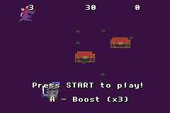

# The game called: Find the Treasure!
- Our Gameboy Project
- Kate and Kelly
- SDEV 301
# Demo

# Installation
- Download the ROM
- Open with Mgba
- Have fun!
# How to play the game?
- It's simple. Get the treasure as many times before the timer runs out. However, a dragon is guarding the treasure and will follow you. Also, there may be a treasure chest that doesn't give points, but rather slow down the player.
- Fun fact: You can use boost to move faster but for what cost? "sike"

A template to explore GBA games and collaboration with git/GitHub. Please see the instructions in [instructions.md](./instructions.md).
