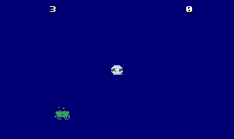

# COLLECTATHON!
For the Collectathon Assignment / SDEV301 Systems Programming. Waves 1 - 6 completed. See planning.md for full game-creation context.

# OVERVIEW / INTRODUCTION

Forked from https://github.com/auberonedu/collectathon. Green River SDEV BAS project for Cohort 23. For the class SDEV301, Systems Programming.
  
-- Credits --
Sprites & Animation by https://github.com/LadyGalatear
 
*
 
Sound Effects by https://github.com/jaronie
 
*
 
Programming and Game Planning by https://github.com/LadyGalatear & https://github.com/jaronie !

## FEATURES

Fetch Thy Oyster is a simple, bit-styled game based on the GameBoy Advance. Features include:
* Artistic crab sprites & oyster.
* Manuever of a crab character, only objective is to "fetch" the oyster entity to feed the crab, and get points!
* Sound effects for immersion.
* Speed boost for when you're in a rush.

