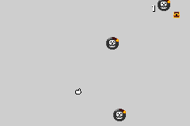

# 🪙 Gold Snatcher

**Gold Snatcher** is a fast-paced arcade-style game built with **Butano for the Game Boy Advance**.  
Control the player, collect as much gold as you can, and avoid bomb sprites that will instantly reset the game. Use limited speed boosts to grab treasure faster—but be careful, bombs respawn every time you score!

The goal is simple: **snatch gold, dodge danger, and rack up the highest score possible.**

---

## ▶️ Play the Game
🔗 **Play here:** https://dennyssaenz123.github.io/collectathon/ 

## 🎮 Gameplay Preview
  

---

## 🕹️ Controls
- **D-Pad** – Move player  
- **A** – Speed boost (limited uses)  
- **START** – Reset game  

---

## 🛠️ Built With
- C++
- Butano (GBA Engine)

---

Grab the gold. Avoid the bombs.  
How long can you survive? 💥
