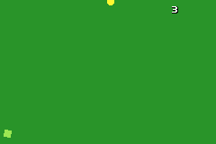

# Rainbow Speedway

Chase the dot, spin across the screen, and watch the background change color every time you score. Rainbow Speedway is a Game Boy Advance game where you try to collect as many dots as you can.

## Play it

[Play Rainbow Speedway here](https://alexandrbalan.github.io/collectathon/)

## How to play

- **D-pad:** move your square. It spins while you move, and it spins faster during a boost.
- **A button:** speed boost. You only get 3 per game, so use them wisely.
- **Start:** reset the game.
- Run off one edge of the screen and you come out the other side.
- Each dot you grab adds 1 to your score and changes the background to a random color.